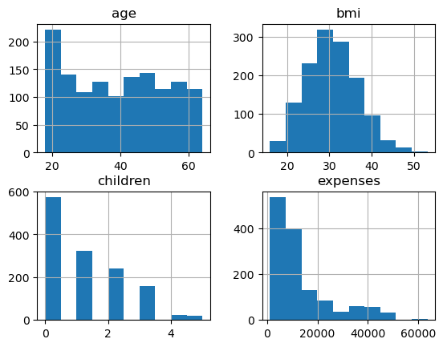
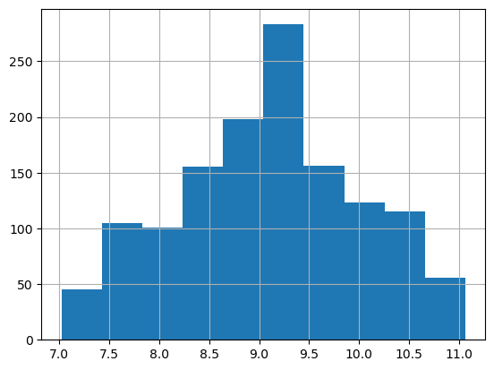
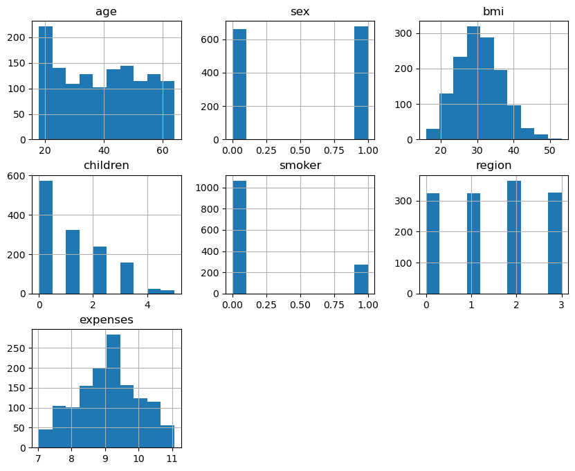
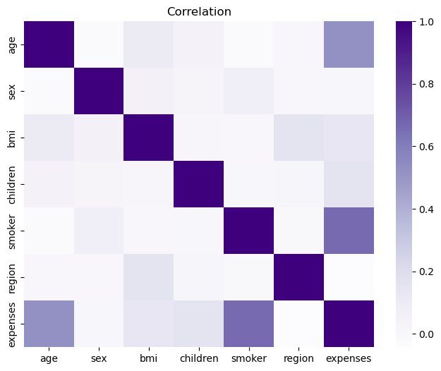
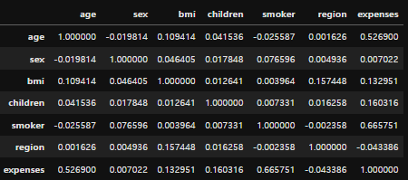
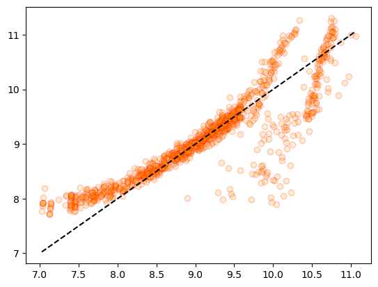
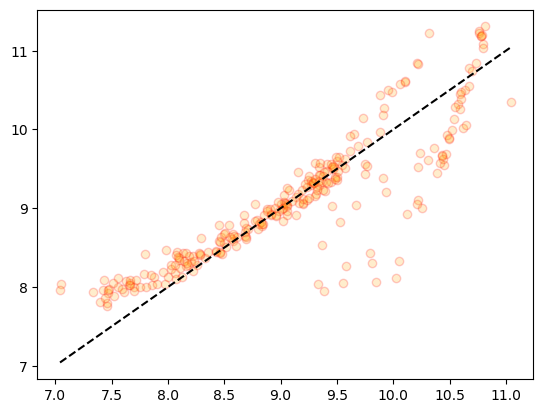
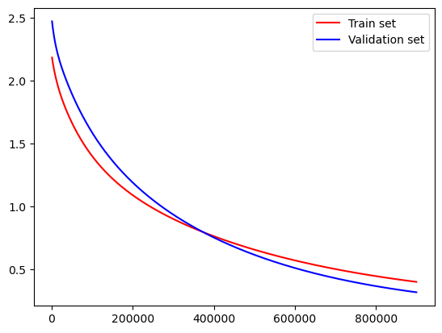

# 🚩 insurance_regresssion

## 보험료 예측

#### https://www.kaggle.com/datasets/noordeen/insurance-premium-prediction

### 1. features

- age - 나이
- sex - 성별
- bmi - bmi
- children - 자식 수
- smoker - 습연 여부
- region - 지역
- expense - 금액(target)

### 2. 데이터 확인

- 결측치와 자료형 중복행 확인 결과 중복행 하나가 있어서 중복행을 제거한 후 범주형 데이터를 제거하고 수치형 데이터만을 사용하여 우선 진행

- 수치형 데이터의 히스토그램
  

- bmi의 분포가 정규분포에 가까운 형태를 띄고있고 전체적이게 우하향하는 모습이다.

### 3. 모델 학습

#### LinearRegression

- LinearRegression의 테스트 결과는  
  MSE: 139834077.0931, RMSE: 11825.1460, MSLE: 0.7987, RMSLE: 0.8937, R2: 0.1234 으로
  처참한 결과가 나왔다.

#### PolynomialFeatures

- PolynomialFeatures를 사용한 Feature를 가지고 다시한번 LinearRegression모델을 사용하였을때  
  MSE: 140795243.3328, RMSE: 11865.7171, MSLE: 0.8100, RMSLE: 0.9000, R2: 0.1174으로  
  이 전과 별 차이 없이 암담한 수치가 나왔다.

### 4. 타겟데이터 로그치환

- 아무 전처리 없이 모델을 사용하였을 때 Loss가 엄청나고 R2스코어가 0.1정도밖에 나오지않아  
  하나씩 전처리를 해보기로 하였다.

- 우선 위의 히스토그램에서 데이터의 분포가 잘 맞지않는것을 확인하였기에 타겟데이터라도 분포를 조정하기 위해  
  타겟데이터를 로그치환하여서 아래와 같은 분포가 되었다.
  

- 그리고 다시한번 모델 학습을 통해 확인해보았다.
- 그냥 LinearRegression모델을 사용하였을 때  
  MSE: 0.6149, RMSE: 0.7842, MSLE: 0.0060, RMSLE: 0.0772, R2: 0.2998으로  
  처음보단 꽤나 괜찮아지긴했지만 그럼에도 아직 한참 부족합니다.
- PolynomialFeatures 후 LinearRegression모델을 사용하였을 때  
  MSE: 0.6213, RMSE: 0.7882, MSLE: 0.0060, RMSLE: 0.0775, R2: 0.2926 가 되었지만  
  그럼에도 여전히 수치가 좋지않은 모습입니다.

### 5. 범주형 데이터 추가

- 타겟데이터의 분포가 꽤나 괜찮아졌음에도 결과가 굉장히 마음에 들지않지만  
  우선 범주형 데이터를 추가해보기로 했습니다.
- 범주형 데이터들을 LabelEncoder를 사용하여 인코딩하고 다시 모델학습을 해보기로 하였습니다.

- 아래는 범주형 데이터를 추가한 후 히스토그램입니다.
  

- smoker 피쳐의 불균형이 크게 보이지만 일단 진행해보기로 하였습니다.

- 그냥 LinearRegression모델을 사용하였을 때  
  MSE: 0.2047, RMSE: 0.4525, MSLE: 0.0020, RMSLE: 0.0448, R2: 0.7669으로  
  R2가 0.76이나 되어서 아주 괜찮아졌습니다.
- PolynomialFeatures 후 LinearRegression모델을 사용하였을 때  
  MSE: 0.1477, RMSE: 0.3843, MSLE: 0.0015, RMSLE: 0.0383, R2: 0.8318 가 되어서  
  굉장히 양호해졌습니다.  
   

- 트리모델을 사용한 결과 또한
- DecisionTreeRegressor - MSE: 0.2885, RMSE: 0.5371, MSLE: 0.0029, RMSLE: 0.0539, R2: 0.6715
- RandomForestRegressor - MSE: 0.1723, RMSE: 0.4151, MSLE: 0.0018, RMSLE: 0.0420, R2: 0.8038
- GradientBoostingRegressor - MSE: 0.1537, RMSE: 0.3920, MSLE: 0.0015, RMSLE: 0.0393, R2: 0.8250
- XGBRegressor - MSE: 0.2066, RMSE: 0.4545, MSLE: 0.0021, RMSLE: 0.0460, R2: 0.7648
- LGBMRegressor - MSE: 0.1658, RMSE: 0.4072, MSLE: 0.0017, RMSLE: 0.0411, R2: 0.8112
- 으로 결과가 좋은 모습을 보입니다.  
   

- 따라서 해당 데이터는 선형성이 강하다고 판단하고 LinearRegression모델을 사용하여 진행하기로 하였습니다.

### 6. 상관관계

- corr()을 통해 상관관계를 보았을때
  
  
- 타겟과의 상관관계가 낮은 피쳐들이 있지만 결과가 잘 나오고 피쳐가 너무 적어서 제거하지 않고 진행하기로 하였습니다.

### 6. 검증

- 일반 train데이터와 test데이터와 train데이터에서 다시 나눈 validation 데이터를 만들어 검증하였습니다.

- train - MSE: 0.1949, RMSE: 0.4415, MSLE: 0.0019, RMSLE: 0.0437, R2: 0.7664
- test - MSE: 0.2047, RMSE: 0.4525, MSLE: 0.0020, RMSLE: 0.0448, R2: 0.7669
- validation - MSE: 0.1590, RMSE: 0.3987, MSLE: 0.0016, RMSLE: 0.0399, R2: 0.8076
- kfold - cross_val_score를 통한 R2: 0.7609

- 위의 결과를 통해 해당 모델의 과적합이 발생하지 않았다고 판단하였고, 시각화를통해 확인해보았습니다.
- train데이터  
  

- test데이터  
  

- train과 test데이터의 결과가 비슷한 분포를 나타내어 과적합이 발생하지 않았다고 판단하였습니다.
- 또한 target의 값이 9.5~10.5정도 구간에 오차가 꽤나 있는것을 확인하였습니다.

- pytorch를 사용하여 각 구간별 가중치와 편향, loss값을 구하여 시각화 하였습니다.
  
- 위의 그래프를 통해 train데이터와 validation 데이터의 loss값이 거의 비슷한 양상을 띄고 있다는것을 확인할 수 있었습니다.

### 7. 결론

- 해당 모델은 선형적인 성향이 강하며 과적합의 위험이 적고 최종적으로 test 결과  
  MSE: 0.2047, RMSE: 0.4525, MSLE: 0.0020, RMSLE: 0.0448, R2: 0.7669으로  
  Linear_regression이 적합한 모델이라고 판단하였습니다.

### 8. 느낀점

- 데이터가 선형적인지 비선형적인지 구분하는데에 어려움이 있었으며,
- 시각화를 통해 오차가 많은 구간을 확인하였고 해당 문제를 해결해보려 하였으나  
  가장 오차가 큰 구간인 9.5 ~ 10.5 구간과 가장 정답이 많았던 7.5 ~ 9.5구간을 분리하여 확인해본 결과  
  타겟과의 상관관계가 가장 높았던 smoker피쳐의 분포의 차이가 있었음을 확인하였습니다.  
  하지만 가장 정답이 많은 구간은 Smoker피쳐의 0과 1중 1의 데이터가 거의 없었다는것을 확인하였고
  반대로 오차가 큰 구간은 smoker피쳐의 균형이 아주 잘 맞는 모습이었습니다.  
  따라서 smoker피쳐의 균형을 맞추려고 하였으나 데이터를 수집하는데엔 어려움이 있어서,  
  언더샘플링하였으나 그렇다할 결과는 내지 못한채로 마무리되어 아쉬웠습니다.
