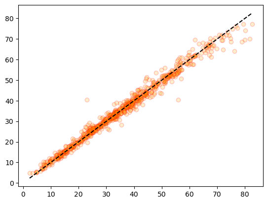
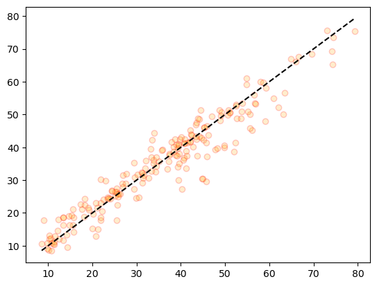
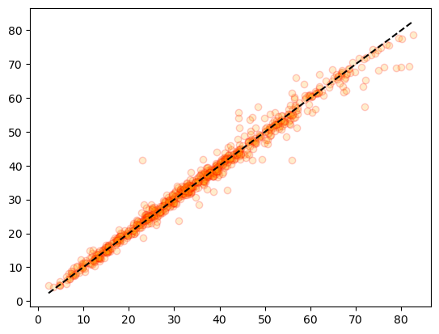
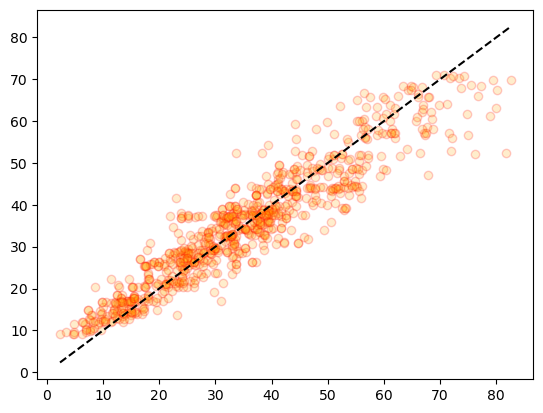
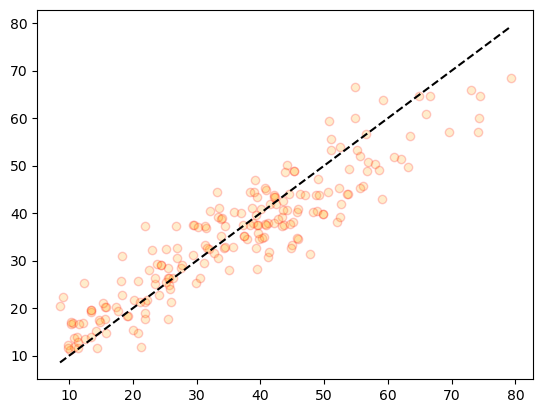

# 🚩 concrete_regresssion

## 콘크리트 강도 예측

#### https://www.kaggle.com/datasets/elikplim/concrete-compressive-strength-data-set

### features

- cement - 시멘트(kg)
- blast_furnace_slag - 고로 슬래그(kg)
- fly_ash - 비산회(kg)
- water - 물(kg)
- superplasticizer - 슈퍼플라스티서(가소재, kg)
- coarse_aggregate - 골재(kg)
- fine_aggregate - 미세 골재(kg)
- age - 경과 시간
- concrete_compressive_strength - 콘크리트 강도, 압력

### 1. 데이터 확인

- info(), duplicated(), isna()를 통해 자료형, 중복행, 결측치를 확인하였을때,  
  25개의 중복행이 있는것을 확인하여 제거하였습니다.

- 모든 데이터가 수치형이라 히스토그램을 확인하였습니다.
  

- 몇몇 피쳐의 분포가 한쪽으로 많이 몰려있는것을 확인하였습니다.

### 2. 모델 학습

- 아무 전처리 없이 LinearRegression모델의 결과는  
  MSE: 116.2002, RMSE: 10.7796, MSLE: 0.1056, RMSLE: 0.3250, R2: 0.5443이며,

- PolynomialFeatures를 사용한 후 해당 feature를 사용한 LinearRegression모델의 결과는  
  MSE: 39.8754, RMSE: 6.3147, MSLE: 0.0348, RMSLE: 0.1866, R2: 0.8436으로  
  R2스코어가 꽤나 높아진것을 확인하였습니다.  
   

- tree모델과 부스팅모델
- DecisionTreeRegressor  
  MSE: 48.2259, RMSE: 6.9445, MSLE: 0.0427, RMSLE: 0.2065, R2: 0.8109

- RandomForestRegressor  
  MSE: 24.8581, RMSE: 4.9858, MSLE: 0.0254, RMSLE: 0.1594, R2: 0.9025

- GradientBoostingRegressor  
  MSE: 23.4471, RMSE: 4.8422, MSLE: 0.0246, RMSLE: 0.1569, R2: 0.9080

- XGBRegressor  
  MSE: 19.3213, RMSE: 4.3956, MSLE: 0.0204, RMSLE: 0.1428, R2: 0.9242

- LGBMRegressor  
  MSE: 18.9986, RMSE: 4.3587, MSLE: 0.0193, RMSLE: 0.1390, R2: 0.9255

- 위의 결과들을 보아 해당 데이터는 비선형적이라고 단정지어 말하기엔 선형성이 있지만,  
  비선형성이 강해 비선형데이터로 간주하고 진행하였습니다.

### 3. 검증

- 일반 train데이터와 test데이터와 train데이터에서 다시 나눈 validation 데이터를 만들어 검증하였습니다.

- train - MSE: 4.5481, RMSE: 2.1326, MSLE: 0.0044, RMSLE: 0.0661, R2: 0.9830
- test - MSE: 21.7049, RMSE: 4.6588, MSLE: 0.0218, RMSLE: 0.1477, R2: 0.9149
- validation - MSE: 17.1984, RMSE: 4.1471, MSLE: 0.0257, RMSLE: 0.1602, R2: 0.9408
- kfold - cross_val_score를 통한 R2: 0.8996

- 위의 결과를 통해 해당 모델의 과적합이 발생하였다 판단하였고, 시각화를통해 확인해보았습니다.
- train데이터의 결과  
  
- test데이터의 결과  
  

- 시각화를 통해서도 과적합이 발생하였다 판단이 됩니다.

### 4. 전처리

- 우선 상관관계를 확인해보았을 때

### corr

<table border="1">
  <thead>
    <tr style="text-align: right;">
      <th></th>
      <th>cement</th>
      <th>blast_furnace_slag</th>
      <th>fly_ash</th>
      <th>water</th>
      <th>superplasticizer</th>
      <th>coarse_aggregate</th>
      <th>fine_aggregate</th>
      <th>age</th>
      <th>concrete_compressive_strength</th>
    </tr>
  </thead>
  <tbody>
    <tr>
      <th>cement</th>
      <td>1.000000</td>
      <td>-0.303324</td>
      <td>-0.385610</td>
      <td>-0.056625</td>
      <td>0.060906</td>
      <td>-0.086205</td>
      <td>-0.245375</td>
      <td>0.086348</td>
      <td>0.488283</td>
    </tr>
    <tr>
      <th>blast_furnace_slag</th>
      <td>-0.303324</td>
      <td>1.000000</td>
      <td>-0.312352</td>
      <td>0.130262</td>
      <td>0.019800</td>
      <td>-0.277559</td>
      <td>-0.289685</td>
      <td>-0.042759</td>
      <td>0.103374</td>
    </tr>
    <tr>
      <th>fly_ash</th>
      <td>-0.385610</td>
      <td>-0.312352</td>
      <td>1.000000</td>
      <td>-0.283314</td>
      <td>0.414213</td>
      <td>-0.026468</td>
      <td>0.090262</td>
      <td>-0.158940</td>
      <td>-0.080648</td>
    </tr>
    <tr>
      <th>water</th>
      <td>-0.056625</td>
      <td>0.130262</td>
      <td>-0.283314</td>
      <td>1.000000</td>
      <td>-0.646946</td>
      <td>-0.212480</td>
      <td>-0.444915</td>
      <td>0.279284</td>
      <td>-0.269624</td>
    </tr>
    <tr>
      <th>superplasticizer</th>
      <td>0.060906</td>
      <td>0.019800</td>
      <td>0.414213</td>
      <td>-0.646946</td>
      <td>1.000000</td>
      <td>-0.241721</td>
      <td>0.207993</td>
      <td>-0.194076</td>
      <td>0.344209</td>
    </tr>
    <tr>
      <th>coarse_aggregate</th>
      <td>-0.086205</td>
      <td>-0.277559</td>
      <td>-0.026468</td>
      <td>-0.212480</td>
      <td>-0.241721</td>
      <td>1.000000</td>
      <td>-0.162187</td>
      <td>-0.005264</td>
      <td>-0.144717</td>
    </tr>
    <tr>
      <th>fine_aggregate</th>
      <td>-0.245375</td>
      <td>-0.289685</td>
      <td>0.090262</td>
      <td>-0.444915</td>
      <td>0.207993</td>
      <td>-0.162187</td>
      <td>1.000000</td>
      <td>-0.156572</td>
      <td>-0.186448</td>
    </tr>
    <tr>
      <th>age</th>
      <td>0.086348</td>
      <td>-0.042759</td>
      <td>-0.158940</td>
      <td>0.279284</td>
      <td>-0.194076</td>
      <td>-0.005264</td>
      <td>-0.156572</td>
      <td>1.000000</td>
      <td>0.337367</td>
    </tr>
    <tr>
      <th>target</th>
      <td>0.488283</td>
      <td>0.103374</td>
      <td>-0.080648</td>
      <td>-0.269624</td>
      <td>0.344209</td>
      <td>-0.144717</td>
      <td>-0.186448</td>
      <td>0.337367</td>
      <td>1.000000</td>
    </tr>
  </tbody>
</table>

### vif

<table border="1" class="dataframe">
  <thead>
    <tr style="text-align: right;">
      <th></th>
      <th>vif_score</th>
      <th>feature</th>
    </tr>
  </thead>
  <tbody>
    <tr>
      <th>0</th>
      <td>15.143662</td>
      <td>cement</td>
    </tr>
    <tr>
      <th>1</th>
      <td>3.260685</td>
      <td>blast_furnace_slag</td>
    </tr>
    <tr>
      <th>2</th>
      <td>4.170393</td>
      <td>fly_ash</td>
    </tr>
    <tr>
      <th>3</th>
      <td>81.401338</td>
      <td>water</td>
    </tr>
    <tr>
      <th>4</th>
      <td>5.170736</td>
      <td>superplasticizer</td>
    </tr>
    <tr>
      <th>5</th>
      <td>84.735483</td>
      <td>coarse_aggregate</td>
    </tr>
    <tr>
      <th>6</th>
      <td>72.490935</td>
      <td>fine_aggregate</td>
    </tr>
    <tr>
      <th>7</th>
      <td>1.696257</td>
      <td>age</td>
    </tr>
  </tbody>
</table>

- 위에서 보다시피 전체적이게 타겟과의 관계가 낮은 모습이라 상관관계가 낮으면서 다중공선성이 높은 피쳐를 우선적으로 제거해보았습니다.
- 그래서 fine_aggregate와 fly_ash, water피쳐를 제거 후

### 전처리 후 vif

<table border="1" class="dataframe">
  <thead>
    <tr style="text-align: right;">
      <th></th>
      <th>vif_score</th>
      <th>feature</th>
    </tr>
  </thead>
  <tbody>
    <tr>
      <th>0</th>
      <td>8.176736</td>
      <td>cement</td>
    </tr>
    <tr>
      <th>1</th>
      <td>1.724853</td>
      <td>blast_furnace_slag</td>
    </tr>
    <tr>
      <th>2</th>
      <td>2.072887</td>
      <td>superplasticizer</td>
    </tr>
    <tr>
      <th>3</th>
      <td>10.012147</td>
      <td>coarse_aggregate</td>
    </tr>
    <tr>
      <th>4</th>
      <td>1.583114</td>
      <td>age</td>
    </tr>
  </tbody>
</table>

- vif스코어는 괜찮아졌다고 판단하였고 이어서 다시한번 확인해보았습니다.

- train데이터 결과  
  MSE: 4.7384, RMSE: 2.1768, MSLE: 0.0039, RMSLE: 0.0623, R2: 0.9823로 여전히 높은 수치를 보이며
  

- test데이터 결과  
  MSE: 20.8434, RMSE: 4.5655, MSLE: 0.0228, RMSLE: 0.1509, R2: 0.9183로 train데이터와의 차이가 꽤 나는 모습을 보아 여전히 과적합이 의심됩니다.
  

### 5. 하이퍼 파라미터 튜닝

- LGBMRegressor모델의 하이퍼 파라미터 튜닝을 통해 과적합을 해소해보기위해 조정해본 결과  
  LGBMRegressor(n_estimators=50, max_depth=2, min_child_samples=20)정도로 맞췄을 경우
- train 데이터 결과  
  MSE: 34.1654, RMSE: 5.8451, MSLE: 0.0369, RMSLE: 0.1921, R2: 0.8722  
  
- test데이터 결과  
  MSE: 41.4416, RMSE: 6.4375, MSLE: 0.0422, RMSLE: 0.2054, R2: 0.8375
  

### 6. 결과

- 상관관계와 다중공선성을 확인 후 피쳐를 제거하고, 하이퍼 파라미터 튜닝을 하여  
  원래 R2스코어가 0.9183이었던 test 결과를 0.8375정도로 맞추고  
  train데이터와 test데이터간의 R2스코어의 차이가 0.04정도로 작은 차이를 보여 어느정도 과적합도 해소가 되었습니다.
- 또한 해당 모델은 선형성이 조금 있지만 아주 비선형적이고 LGBM모델이 가장 적합한 모델이었습니다.
