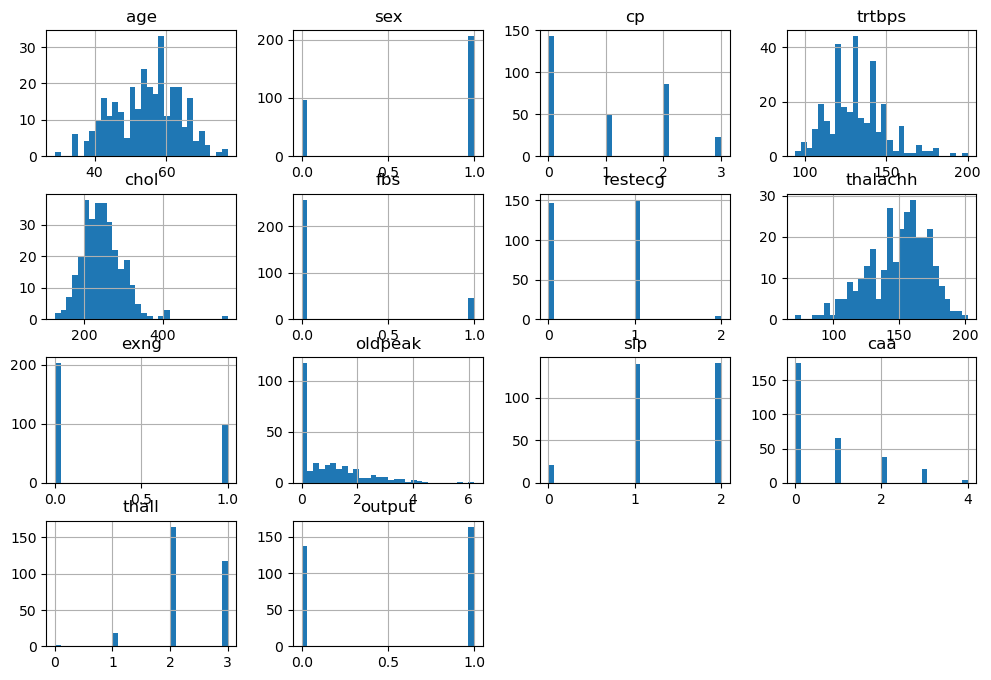
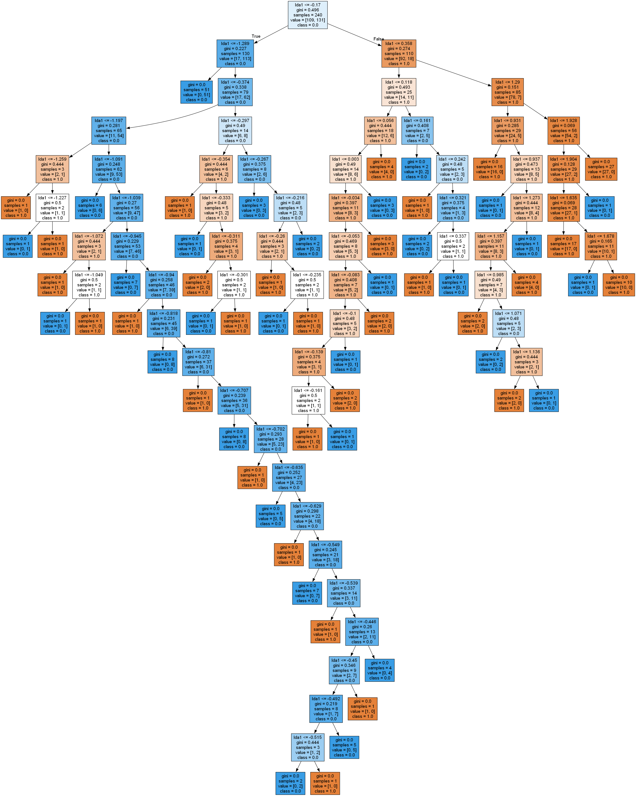
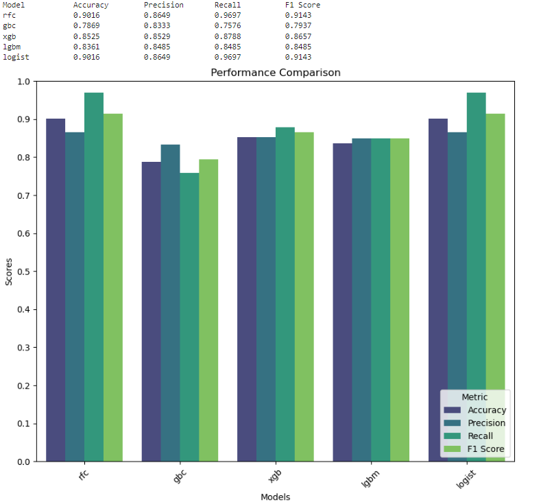
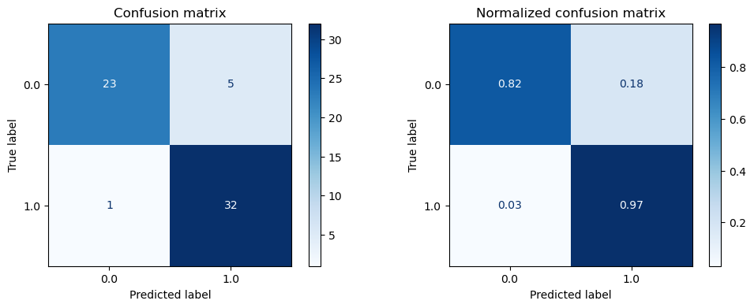
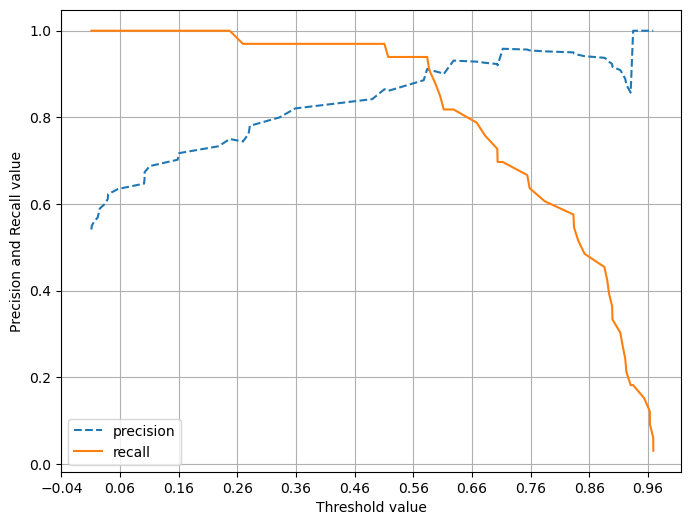
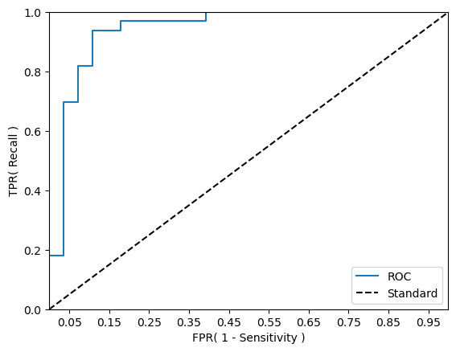

# 🚩 house_price_regression

## 심장마비 분류

### https://www.kaggle.com/datasets/rashikrahmanpritom/heart-attack-analysis-prediction-dataset

## Features

- age - 나이
- sex - 성별
- cp - 흉통 종류
- trtbps - 안정시 혈압
- chol - 콜레스테롤
- fbs - 공복혈당
- restecg - 휴식중 심전도 결과
- thalachh - 최대심박수
- exng - 협심증
- oldpeak - 운동부하
- slp - 심장 전기활동
- caa - 주요 혈관 수
- thall - 방사성 동위원소
- output - 심장마비 여부(target)

### 1. 데이터 확인

- info(), duplicated(), isna()를 통해 자료형, 중복행, 결측치를 확인하였을때,  
  1개의 중복행을 확인하였고 제거하였습니다.

- 이진분류 데이터이며, 모든 피쳐는 수치형이라는것을 확인하였습니다.

- 히스토그램 확인
  

- 균형이 맞지않는 피쳐들이 많이 보입니다. 타겟피쳐의 비율은 크게 차이가 나지 않지만 조금의 차이가 나는것을 확인했습니다.

### 2. 전처리

- 차원축소를 진행하기 위해 다중공선성 확인하며 전처리.

<table border="1" class="dataframe">
  <thead>
    <tr style="text-align: right;">
      <th></th>
      <th>vif_score</th>
      <th>feature</th>
    </tr>
  </thead>
  <tbody>
    <tr>
      <th>0</th>
      <td>39.567644</td>
      <td>age</td>
    </tr>
    <tr>
      <th>1</th>
      <td>3.507112</td>
      <td>sex</td>
    </tr>
    <tr>
      <th>2</th>
      <td>2.409980</td>
      <td>cp</td>
    </tr>
    <tr>
      <th>3</th>
      <td>58.776923</td>
      <td>trtbps</td>
    </tr>
    <tr>
      <th>4</th>
      <td>26.281421</td>
      <td>chol</td>
    </tr>
    <tr>
      <th>5</th>
      <td>1.273256</td>
      <td>fbs</td>
    </tr>
    <tr>
      <th>6</th>
      <td>2.051037</td>
      <td>restecg</td>
    </tr>
    <tr>
      <th>7</th>
      <td>42.631809</td>
      <td>thalachh</td>
    </tr>
    <tr>
      <th>8</th>
      <td>2.022825</td>
      <td>exng</td>
    </tr>
    <tr>
      <th>9</th>
      <td>3.071361</td>
      <td>oldpeak</td>
    </tr>
    <tr>
      <th>10</th>
      <td>10.015857</td>
      <td>slp</td>
    </tr>
    <tr>
      <th>11</th>
      <td>1.860512</td>
      <td>caa</td>
    </tr>
    <tr>
      <th>12</th>
      <td>17.141073</td>
      <td>thall</td>
    </tr>
  </tbody>
</table>

- 전처리 없이 확인한 vif에서 상대적으로 높은 수치들이 여러개 확인되었습니다.  
  하나씩 제거해본 후 결과가 적당해진 시점에서 진행하였습니다.

- trtbps의 vif스코어가 가장 높아서 확인해보았으나 다른피쳐와의 상관관계가 낮아 다음으로  
  vif스코어가 높은 thalachh를 확인해보았는데 몇개의 독립변수들과의 상관관계가  
   0.4가까이 되는것을 확인하였습니다.  
   하지만 thalachh 자체는 타겟과의 관계가 높은편이라  
   thalachh와 관계가 크고 타겟과의 관계가 작은 age피쳐를 제거합니다.

- 다음으로는 타겟과의 상관관계가 0.1도 되지않는 fbs와 chol피쳐를 제거한 후 vif를 확인해보니

<table border="1" class="dataframe">
  <thead>
    <tr style="text-align: right;">
      <th></th>
      <th>vif_score</th>
      <th>feature</th>
    </tr>
  </thead>
  <tbody>
    <tr>
      <th>0</th>
      <td>3.365299</td>
      <td>sex</td>
    </tr>
    <tr>
      <th>1</th>
      <td>2.364969</td>
      <td>cp</td>
    </tr>
    <tr>
      <th>2</th>
      <td>36.863315</td>
      <td>trtbps</td>
    </tr>
    <tr>
      <th>3</th>
      <td>2.018949</td>
      <td>restecg</td>
    </tr>
    <tr>
      <th>4</th>
      <td>39.287291</td>
      <td>thalachh</td>
    </tr>
    <tr>
      <th>5</th>
      <td>1.996700</td>
      <td>exng</td>
    </tr>
    <tr>
      <th>6</th>
      <td>3.016282</td>
      <td>oldpeak</td>
    </tr>
    <tr>
      <th>7</th>
      <td>9.814842</td>
      <td>slp</td>
    </tr>
    <tr>
      <th>8</th>
      <td>1.726323</td>
      <td>caa</td>
    </tr>
    <tr>
      <th>9</th>
      <td>16.248407</td>
      <td>thall</td>
    </tr>
  </tbody>
</table>

- 여전히 30이 넘는 피쳐가 있어서  
  타겟과의 상관관계가 0.2이하인 두 피쳐 중 다른 독립변수들과의 관계가 조금 더 큰 trtbps피쳐를 제거하였습니다.

<table border="1" class="dataframe">
  <thead>
    <tr style="text-align: right;">
      <th></th>
      <th>vif_score</th>
      <th>feature</th>
    </tr>
  </thead>
  <tbody>
    <tr>
      <th>0</th>
      <td>3.357678</td>
      <td>sex</td>
    </tr>
    <tr>
      <th>1</th>
      <td>2.333443</td>
      <td>cp</td>
    </tr>
    <tr>
      <th>2</th>
      <td>2.018568</td>
      <td>restecg</td>
    </tr>
    <tr>
      <th>3</th>
      <td>22.834630</td>
      <td>thalachh</td>
    </tr>
    <tr>
      <th>4</th>
      <td>1.906363</td>
      <td>exng</td>
    </tr>
    <tr>
      <th>5</th>
      <td>2.781007</td>
      <td>oldpeak</td>
    </tr>
    <tr>
      <th>6</th>
      <td>9.721258</td>
      <td>slp</td>
    </tr>
    <tr>
      <th>7</th>
      <td>1.691469</td>
      <td>caa</td>
    </tr>
    <tr>
      <th>8</th>
      <td>15.140299</td>
      <td>thall</td>
    </tr>
  </tbody>
</table>

- 제거 후 vif스코어는 이정도면 괜찮다고 판단되어 차원축소를 진행하였습니다.

### 3. 차원축소(LDA)

- 이진분류 데이터기때문에 1차원으로 축소 후 진행하였습니다.

- pytorch를 사용하여 logistic 회귀를 진행하였을 때  
  정확도: 0.8852, 정밀도: 0.8421, 재현율: 0.9697, F1: 0.9014, ROC-AUC: 0.8777  
  라는 좋은 수치가 나왔습니다.

- 기본적인 분류 모델인 DecisionTreeClassifier를 사용하여 export_graphviz의 트리 시각화를 통해  
  어느정도의 depth와 leaf를 확인해보았습니다.
  

- 아래는 여러개의 모델을 사용하여 테스트 한 결과입니다
- rfc = RandomFrestClassifier
- gbc = GradientBoostingClassifier
- xgb = XGBClassifier
- lgbm = LGBMClassifier
- logist = LogisticRegression

- 보시다시피 rfc와 logistic모델의 결과가 완전 같게 나타났으며 가장 결과가 좋았습니다.

### 4. 임계치 조정

#### 심장병 분류

> True Positive (TP): 모델이 심장병을 심장병으로 분류한 경우  
> False Positive (FP): 모델이 심장병을 정상으로 잘못 분류한 경우  
> True Negative (TN): 모델이 정상인을 정상으로 올바르게 분류한 경우  
> False Negative (FN): 모델이 정상인을 심장병으로 잘못 분류한 경우

- 심장병 환자를 정상으로 판단하여 오진 시 치료를 받지 못해 문제가 생기지만,  
  정상인에게 심장병이라고 오진 시 환자가 당혹스럽긴 하여도  
  재검사 시 정상임을 확인하고 끝낼 수 있기 때문이라 판단하였습니다.

- 따라서 임계치를 높여 정밀도를 올려주는 것이 적합하다고 생각하였습니다.

- Logistic_Regression에 predict_proba를 통해 예측 확률을 받아 각 임계치에 대한 정밀도와 재현율등을 반환받고
- 가장 적절한 스코어등을 사용해 임계치를 정합니다.

- 임계치가 0.6057029604334261일때 정밀도가 딱 0.90이 되어서 해당 임계치를 이용한 오차행렬과 각 수치들을 확인하였습니다.

정확도: 0.8525, 정밀도: 0.9000, 재현율: 0.8182, F1: 0.8571, ROC-AUC: 0.8555

정밀도와 재현율 그래프

- 임계치가 0.56 ~ 0.66사이가 적절하다는것을 확인하였습니다.

roc-curve

- 데이터의 갯수가 적어 그래프가 뚝뚝 꺾이지만, 꽤나 이상적인 형태입니다.

### 결론

- vif스코어를 확인하여 다중공선성을 어느정도 제거한 후 LDA를 통해 차원축소를 하고 logistic 회귀를 통해  
  나온 결과에 임꼐치를 조정하여 원하던대로 정밀도를 높여주었고, 시각화를통해 적절한 임계치를 주었다는것도 확인하였습니다.

- 결과적으로  
  정확도: 0.8525, 정밀도: 0.9000, 재현율: 0.8182, F1: 0.8571, ROC-AUC: 0.8555의 좋은 수치를 보여주어  
  가장 적절하다고 생각되는 Logistic_regression 모델에 임계치 조정까지 성공적이었다고 생각됩니다.
