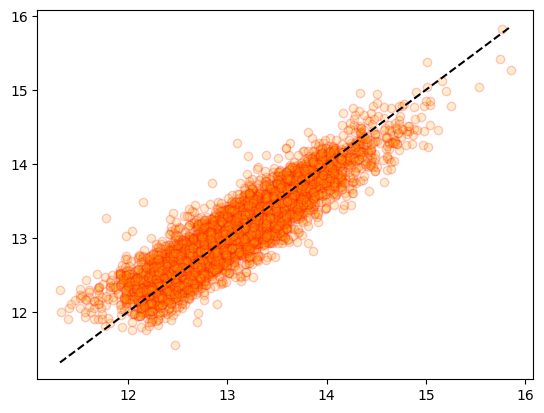

# 🚩 house_price_regression

## 건물 가격 예측

#### https://www.kaggle.com/datasets/harlfoxem/housesalesprediction

## Fetures

- id - idf
- data - 데이터 등록 날짜
- price - 가격(target)
- bedrooms - 침실 수
- bathrooms - 화장실 수
- sqft_living - 평방피트(거실)
- sqft_lot - 평방피트(땅)
- floors - 층
- waterfront - 주변에 강, 호수, 바다등이 있는지
- view - 경치
- condition - 상태
- grade - 등급, 품질
- sqft_above - 평방피트(지상층)
- sqft_basement - 평방피트(지하실)
- yr_built - 건축일
- yr_renovated - 리모델링일
- zipcode - 우편주소
- lat - 위도
- long - 경도
- sqft_living15 - 최근 15년간 리모델링된 평방피트
- sqft_lot15 - 최근 15년간 리모델링된 땅 평방피트

### 1. 데이터 확인

 info(), duplicated(), isna()를 통해 자료형, 중복행, 결측치를 확인하였을때,  
  이상이 없다는것을 확인하였습니다.-

- 필요없다고 판단되는 id,와 date 피쳐를 제거하였습니다.

- 상관관계와 히스토그램을 확인하였습니다.
<table border="1" class="dataframe">
  <thead>
    <tr style="text-align: right;">
      <th></th>
      <th>bedrooms</th>
      <th>bathrooms</th>
      <th>sqft_living</th>
      <th>sqft_lot</th>
      <th>floors</th>
      <th>waterfront</th>
      <th>view</th>
      <th>condition</th>
      <th>grade</th>
      <th>sqft_above</th>
      <th>sqft_basement</th>
      <th>yr_built</th>
      <th>yr_renovated</th>
      <th>zipcode</th>
      <th>lat</th>
      <th>long</th>
      <th>sqft_living15</th>
      <th>sqft_lot15</th>
      <th>target</th>
    </tr>
  </thead>
  <tbody>
    <tr>
      <th>bedrooms</th>
      <td>1.000000</td>
      <td>0.515884</td>
      <td>0.576671</td>
      <td>0.031703</td>
      <td>0.175429</td>
      <td>-0.006582</td>
      <td>0.079532</td>
      <td>0.028472</td>
      <td>0.356967</td>
      <td>0.477600</td>
      <td>0.303093</td>
      <td>0.154178</td>
      <td>0.018841</td>
      <td>-0.152668</td>
      <td>-0.008931</td>
      <td>0.129473</td>
      <td>0.391638</td>
      <td>0.029244</td>
      <td>0.308350</td>
    </tr>
    <tr>
      <th>bathrooms</th>
      <td>0.515884</td>
      <td>1.000000</td>
      <td>0.754665</td>
      <td>0.087740</td>
      <td>0.500653</td>
      <td>0.063744</td>
      <td>0.187737</td>
      <td>-0.124982</td>
      <td>0.664983</td>
      <td>0.685342</td>
      <td>0.283770</td>
      <td>0.506019</td>
      <td>0.050739</td>
      <td>-0.203866</td>
      <td>0.024573</td>
      <td>0.223042</td>
      <td>0.568634</td>
      <td>0.087175</td>
      <td>0.525138</td>
    </tr>
    <tr>
      <th>sqft_living</th>
      <td>0.576671</td>
      <td>0.754665</td>
      <td>1.000000</td>
      <td>0.172826</td>
      <td>0.353949</td>
      <td>0.103818</td>
      <td>0.284611</td>
      <td>-0.058753</td>
      <td>0.762704</td>
      <td>0.876597</td>
      <td>0.435043</td>
      <td>0.318049</td>
      <td>0.055363</td>
      <td>-0.199430</td>
      <td>0.052529</td>
      <td>0.240223</td>
      <td>0.756420</td>
      <td>0.183286</td>
      <td>0.702035</td>
    </tr>
    <tr>
      <th>sqft_lot</th>
      <td>0.031703</td>
      <td>0.087740</td>
      <td>0.172826</td>
      <td>1.000000</td>
      <td>-0.005201</td>
      <td>0.021604</td>
      <td>0.074710</td>
      <td>-0.008958</td>
      <td>0.113621</td>
      <td>0.183512</td>
      <td>0.015286</td>
      <td>0.053080</td>
      <td>0.007644</td>
      <td>-0.129574</td>
      <td>-0.085683</td>
      <td>0.229521</td>
      <td>0.144608</td>
      <td>0.718557</td>
      <td>0.089661</td>
    </tr>
    <tr>
      <th>floors</th>
      <td>0.175429</td>
      <td>0.500653</td>
      <td>0.353949</td>
      <td>-0.005201</td>
      <td>1.000000</td>
      <td>0.023698</td>
      <td>0.029444</td>
      <td>-0.263768</td>
      <td>0.458183</td>
      <td>0.523885</td>
      <td>-0.245705</td>
      <td>0.489319</td>
      <td>0.006338</td>
      <td>-0.059121</td>
      <td>0.049614</td>
      <td>0.125419</td>
      <td>0.279885</td>
      <td>-0.011269</td>
      <td>0.256794</td>
    </tr>
    <tr>
      <th>waterfront</th>
      <td>-0.006582</td>
      <td>0.063744</td>
      <td>0.103818</td>
      <td>0.021604</td>
      <td>0.023698</td>
      <td>1.000000</td>
      <td>0.401857</td>
      <td>0.016653</td>
      <td>0.082775</td>
      <td>0.072075</td>
      <td>0.080588</td>
      <td>-0.026161</td>
      <td>0.092885</td>
      <td>0.030285</td>
      <td>-0.014274</td>
      <td>-0.041910</td>
      <td>0.086463</td>
      <td>0.030703</td>
      <td>0.266369</td>
    </tr>
    <tr>
      <th>view</th>
      <td>0.079532</td>
      <td>0.187737</td>
      <td>0.284611</td>
      <td>0.074710</td>
      <td>0.029444</td>
      <td>0.401857</td>
      <td>1.000000</td>
      <td>0.045990</td>
      <td>0.251321</td>
      <td>0.167649</td>
      <td>0.276947</td>
      <td>-0.053440</td>
      <td>0.103917</td>
      <td>0.084827</td>
      <td>0.006157</td>
      <td>-0.078400</td>
      <td>0.280439</td>
      <td>0.072575</td>
      <td>0.397293</td>
    </tr>
    <tr>
      <th>condition</th>
      <td>0.028472</td>
      <td>-0.124982</td>
      <td>-0.058753</td>
      <td>-0.008958</td>
      <td>-0.263768</td>
      <td>0.016653</td>
      <td>0.045990</td>
      <td>1.000000</td>
      <td>-0.144674</td>
      <td>-0.158214</td>
      <td>0.174105</td>
      <td>-0.361417</td>
      <td>-0.060618</td>
      <td>0.003026</td>
      <td>-0.014941</td>
      <td>-0.106500</td>
      <td>-0.092824</td>
      <td>-0.003406</td>
      <td>0.036362</td>
    </tr>
    <tr>
      <th>grade</th>
      <td>0.356967</td>
      <td>0.664983</td>
      <td>0.762704</td>
      <td>0.113621</td>
      <td>0.458183</td>
      <td>0.082775</td>
      <td>0.251321</td>
      <td>-0.144674</td>
      <td>1.000000</td>
      <td>0.755923</td>
      <td>0.168392</td>
      <td>0.446963</td>
      <td>0.014414</td>
      <td>-0.184862</td>
      <td>0.114084</td>
      <td>0.198372</td>
      <td>0.713202</td>
      <td>0.119248</td>
      <td>0.667434</td>
    </tr>
    <tr>
      <th>sqft_above</th>
      <td>0.477600</td>
      <td>0.685342</td>
      <td>0.876597</td>
      <td>0.183512</td>
      <td>0.523885</td>
      <td>0.072075</td>
      <td>0.167649</td>
      <td>-0.158214</td>
      <td>0.755923</td>
      <td>1.000000</td>
      <td>-0.051943</td>
      <td>0.423898</td>
      <td>0.023285</td>
      <td>-0.261190</td>
      <td>-0.000816</td>
      <td>0.343803</td>
      <td>0.731870</td>
      <td>0.194050</td>
      <td>0.605567</td>
    </tr>
    <tr>
      <th>sqft_basement</th>
      <td>0.303093</td>
      <td>0.283770</td>
      <td>0.435043</td>
      <td>0.015286</td>
      <td>-0.245705</td>
      <td>0.080588</td>
      <td>0.276947</td>
      <td>0.174105</td>
      <td>0.168392</td>
      <td>-0.051943</td>
      <td>1.000000</td>
      <td>-0.133124</td>
      <td>0.071323</td>
      <td>0.074845</td>
      <td>0.110538</td>
      <td>-0.144765</td>
      <td>0.200355</td>
      <td>0.017276</td>
      <td>0.323816</td>
    </tr>
    <tr>
      <th>yr_built</th>
      <td>0.154178</td>
      <td>0.506019</td>
      <td>0.318049</td>
      <td>0.053080</td>
      <td>0.489319</td>
      <td>-0.026161</td>
      <td>-0.053440</td>
      <td>-0.361417</td>
      <td>0.446963</td>
      <td>0.423898</td>
      <td>-0.133124</td>
      <td>1.000000</td>
      <td>-0.224874</td>
      <td>-0.346869</td>
      <td>-0.148122</td>
      <td>0.409356</td>
      <td>0.326229</td>
      <td>0.070958</td>
      <td>0.054012</td>
    </tr>
    <tr>
      <th>yr_renovated</th>
      <td>0.018841</td>
      <td>0.050739</td>
      <td>0.055363</td>
      <td>0.007644</td>
      <td>0.006338</td>
      <td>0.092885</td>
      <td>0.103917</td>
      <td>-0.060618</td>
      <td>0.014414</td>
      <td>0.023285</td>
      <td>0.071323</td>
      <td>-0.224874</td>
      <td>1.000000</td>
      <td>0.064357</td>
      <td>0.029398</td>
      <td>-0.068372</td>
      <td>-0.002673</td>
      <td>0.007854</td>
      <td>0.126434</td>
    </tr>
    <tr>
      <th>zipcode</th>
      <td>-0.152668</td>
      <td>-0.203866</td>
      <td>-0.199430</td>
      <td>-0.129574</td>
      <td>-0.059121</td>
      <td>0.030285</td>
      <td>0.084827</td>
      <td>0.003026</td>
      <td>-0.184862</td>
      <td>-0.261190</td>
      <td>0.074845</td>
      <td>-0.346869</td>
      <td>0.064357</td>
      <td>1.000000</td>
      <td>0.267048</td>
      <td>-0.564072</td>
      <td>-0.279033</td>
      <td>-0.147221</td>
      <td>-0.053203</td>
    </tr>
    <tr>
      <th>lat</th>
      <td>-0.008931</td>
      <td>0.024573</td>
      <td>0.052529</td>
      <td>-0.085683</td>
      <td>0.049614</td>
      <td>-0.014274</td>
      <td>0.006157</td>
      <td>-0.014941</td>
      <td>0.114084</td>
      <td>-0.000816</td>
      <td>0.110538</td>
      <td>-0.148122</td>
      <td>0.029398</td>
      <td>0.267048</td>
      <td>1.000000</td>
      <td>-0.135512</td>
      <td>0.048858</td>
      <td>-0.086419</td>
      <td>0.307003</td>
    </tr>
    <tr>
      <th>long</th>
      <td>0.129473</td>
      <td>0.223042</td>
      <td>0.240223</td>
      <td>0.229521</td>
      <td>0.125419</td>
      <td>-0.041910</td>
      <td>-0.078400</td>
      <td>-0.106500</td>
      <td>0.198372</td>
      <td>0.343803</td>
      <td>-0.144765</td>
      <td>0.409356</td>
      <td>-0.068372</td>
      <td>-0.564072</td>
      <td>-0.135512</td>
      <td>1.000000</td>
      <td>0.334605</td>
      <td>0.254451</td>
      <td>0.021626</td>
    </tr>
    <tr>
      <th>sqft_living15</th>
      <td>0.391638</td>
      <td>0.568634</td>
      <td>0.756420</td>
      <td>0.144608</td>
      <td>0.279885</td>
      <td>0.086463</td>
      <td>0.280439</td>
      <td>-0.092824</td>
      <td>0.713202</td>
      <td>0.731870</td>
      <td>0.200355</td>
      <td>0.326229</td>
      <td>-0.002673</td>
      <td>-0.279033</td>
      <td>0.048858</td>
      <td>0.334605</td>
      <td>1.000000</td>
      <td>0.183192</td>
      <td>0.585379</td>
    </tr>
    <tr>
      <th>sqft_lot15</th>
      <td>0.029244</td>
      <td>0.087175</td>
      <td>0.183286</td>
      <td>0.718557</td>
      <td>-0.011269</td>
      <td>0.030703</td>
      <td>0.072575</td>
      <td>-0.003406</td>
      <td>0.119248</td>
      <td>0.194050</td>
      <td>0.017276</td>
      <td>0.070958</td>
      <td>0.007854</td>
      <td>-0.147221</td>
      <td>-0.086419</td>
      <td>0.254451</td>
      <td>0.183192</td>
      <td>1.000000</td>
      <td>0.082447</td>
    </tr>
    <tr>
      <th>target</th>
      <td>0.308350</td>
      <td>0.525138</td>
      <td>0.702035</td>
      <td>0.089661</td>
      <td>0.256794</td>
      <td>0.266369</td>
      <td>0.397293</td>
      <td>0.036362</td>
      <td>0.667434</td>
      <td>0.605567</td>
      <td>0.323816</td>
      <td>0.054012</td>
      <td>0.126434</td>
      <td>-0.053203</td>
      <td>0.307003</td>
      <td>0.021626</td>
      <td>0.585379</td>
      <td>0.082447</td>
      <td>1.000000</td>
    </tr>
  </tbody>
</table>

- LinearRegression모델로 학습후 예측한 결과  
  MSE: 36867855391.4833, RMSE: 192010.0398, R2: 0.7077으로 수치 자체는 나쁘지않게 나타났습니다.

### 2. 전처리

- 히스토그램상으로 보았을 때 분포가 한쪽으로 몰려있는 피쳐가 많고 이상치또한 꽤나 있다고 판단하였습니다.
- 타겟피쳐와의 상관관계가 낮은 피쳐들도 꽤나 있었습니다.

- 타겟피쳐 로그치환
  

- 타겟피쳐를 로그치환한 후 LinearRegression모델의 학습 결과는  
  MSE: 0.0612, RMSE: 0.2473, R2: 0.7800으로 R2스코어가 조금 올랐습니다.

- PolynomialFeatures를 사용한 후 LinearRegression모델의 결과는  
  MSE: 0.0476, RMSE: 0.2181, R2: 0.8305정도로 그냥 LinearRegression모델을 사용하였을 때 보다  
  조금 더 좋은 결과가 나타났습니다.

- 수치가 조금 높아 과적합의 우려가 조금 있어서 train과 test데이터로 각각 예측 후 시각화를 통해 확인해보았습니다.

- train데이터로 예측 결과  
  MSE: 0.0473, RMSE: 0.2175, R2: 0.8281
  
- test데이터의 예측 결과  
  MSE: 0.0476, RMSE: 0.2181, R2: 0.8305
  

- train데이터와 test데이터의 예측 R2가 큰 차이가 없지만  
  거의 조정하지 않았음에도 잘 나오는것이 미심쩍어 vif를 확인해보았습니다.

<table border="1" class="dataframe">
  <thead>
    <tr style="text-align: right;">
      <th></th>
      <th>vif_score</th>
      <th>feature</th>
    </tr>
  </thead>
  <tbody>
    <tr>
      <th>0</th>
      <td>2.327239e+01</td>
      <td>bedrooms</td>
    </tr>
    <tr>
      <th>1</th>
      <td>2.861188e+01</td>
      <td>bathrooms</td>
    </tr>
    <tr>
      <th>2</th>
      <td>inf</td>
      <td>sqft_living</td>
    </tr>
    <tr>
      <th>3</th>
      <td>2.377656e+00</td>
      <td>sqft_lot</td>
    </tr>
    <tr>
      <th>4</th>
      <td>1.689222e+01</td>
      <td>floors</td>
    </tr>
    <tr>
      <th>5</th>
      <td>1.212827e+00</td>
      <td>waterfront</td>
    </tr>
    <tr>
      <th>6</th>
      <td>1.551834e+00</td>
      <td>view</td>
    </tr>
    <tr>
      <th>7</th>
      <td>3.471167e+01</td>
      <td>condition</td>
    </tr>
    <tr>
      <th>8</th>
      <td>1.473809e+02</td>
      <td>grade</td>
    </tr>
    <tr>
      <th>9</th>
      <td>inf</td>
      <td>sqft_above</td>
    </tr>
    <tr>
      <th>10</th>
      <td>inf</td>
      <td>sqft_basement</td>
    </tr>
    <tr>
      <th>11</th>
      <td>9.588180e+03</td>
      <td>yr_built</td>
    </tr>
    <tr>
      <th>12</th>
      <td>1.195015e+00</td>
      <td>yr_renovated</td>
    </tr>
    <tr>
      <th>13</th>
      <td>1.630845e+06</td>
      <td>zipcode</td>
    </tr>
    <tr>
      <th>14</th>
      <td>1.390263e+05</td>
      <td>lat</td>
    </tr>
    <tr>
      <th>15</th>
      <td>1.359553e+06</td>
      <td>long</td>
    </tr>
    <tr>
      <th>16</th>
      <td>2.710315e+01</td>
      <td>sqft_living15</td>
    </tr>
    <tr>
      <th>17</th>
      <td>2.598758e+00</td>
      <td>sqft_lot15</td>
    </tr>
  </tbody>
</table>

- vif확인결과 다중공선성에 굉장한 문제가 있다는것을 확인할 수 있었습니다.

- 타겟과의 상관관계와 각 독립변수들간의 상관관계를 확인 후 피쳐를 제거하기로 하였습니다.
- 우선적으로 vif를 확인하였을때 infinity였던 피쳐들부터 확인해보았습니다.
- sqft_living, sqft_above와 sqft_basement세개의 피쳐가 inf여서  
  타겟피쳐와 상관관계가 더 낮은 sqft_above를 제거하였습니다.

- 피쳐 하나 제거 후 vif
<table border="1" class="dataframe">
  <thead>
    <tr style="text-align: right;">
      <th></th>
      <th>vif_score</th>
      <th>feature</th>
    </tr>
  </thead>
  <tbody>
    <tr>
      <th>0</th>
      <td>2.327239e+01</td>
      <td>bedrooms</td>
    </tr>
    <tr>
      <th>1</th>
      <td>2.861188e+01</td>
      <td>bathrooms</td>
    </tr>
    <tr>
      <th>2</th>
      <td>3.701949e+01</td>
      <td>sqft_living</td>
    </tr>
    <tr>
      <th>3</th>
      <td>2.377656e+00</td>
      <td>sqft_lot</td>
    </tr>
    <tr>
      <th>4</th>
      <td>1.689222e+01</td>
      <td>floors</td>
    </tr>
    <tr>
      <th>5</th>
      <td>1.212827e+00</td>
      <td>waterfront</td>
    </tr>
    <tr>
      <th>6</th>
      <td>1.551834e+00</td>
      <td>view</td>
    </tr>
    <tr>
      <th>7</th>
      <td>3.471167e+01</td>
      <td>condition</td>
    </tr>
    <tr>
      <th>8</th>
      <td>1.473809e+02</td>
      <td>grade</td>
    </tr>
    <tr>
      <th>9</th>
      <td>2.793485e+00</td>
      <td>sqft_basement</td>
    </tr>
    <tr>
      <th>10</th>
      <td>9.588180e+03</td>
      <td>yr_built</td>
    </tr>
    <tr>
      <th>11</th>
      <td>1.195015e+00</td>
      <td>yr_renovated</td>
    </tr>
    <tr>
      <th>12</th>
      <td>1.630845e+06</td>
      <td>zipcode</td>
    </tr>
    <tr>
      <th>13</th>
      <td>1.390263e+05</td>
      <td>lat</td>
    </tr>
    <tr>
      <th>14</th>
      <td>1.359553e+06</td>
      <td>long</td>
    </tr>
    <tr>
      <th>15</th>
      <td>2.710315e+01</td>
      <td>sqft_living15</td>
    </tr>
    <tr>
      <th>16</th>
      <td>2.598758e+00</td>
      <td>sqft_lot15</td>
    </tr>
  </tbody>
</table>

- inf가 나타나진 않았지만 여전히 굉장히 높은 다중공선성을 보여주어 다음으로 수치가 높은  
  zipcode와 long피쳐를 확인했습니다.

- 확인 결과 zipcode와 long은 다른피쳐와의 관계가 거의 없어서 다른 피쳐와의 관계가 높은 sqft_living과 grade를 확인해보았습니다.

- 그런데 sqft_living과 grade 두개의 피쳐는 타겟과의 상관관계가 너무 높아 타겟과의 상관관계가 0.3이하인 피쳐들을 제거해보기로 하였습니다.

### 타겟과의 상관관계

grade 0.703634  
sqft_living 0.695341  
sqft_living15 0.619312  
bathrooms 0.550802  
lat 0.449174  
view 0.346522  
bedrooms 0.343561  
sqft_basement 0.316970  
floors 0.310558  
waterfront 0.174586  
yr_renovated 0.114498  
sqft_lot 0.099622  
sqft_lot15 0.091592  
yr_built 0.080654  
long 0.049942  
condition 0.039558  
zipcode -0.038306

- 이 중 타겟과의 관계가 낮은 waterfront, yr_renovated, sqft_lot, sqft_lot15, yr_built, long, condition, zipcode 피쳐들을 제거하였습니다.

- 제거 후 vif스코어를 다시 확인해보았습니다.
<table border="1" class="dataframe">
  <thead>
    <tr style="text-align: right;">
      <th></th>
      <th>vif_score</th>
      <th>feature</th>
    </tr>
  </thead>
  <tbody>
    <tr>
      <th>0</th>
      <td>22.819014</td>
      <td>bedrooms</td>
    </tr>
    <tr>
      <th>1</th>
      <td>24.968924</td>
      <td>bathrooms</td>
    </tr>
    <tr>
      <th>2</th>
      <td>34.702393</td>
      <td>sqft_living</td>
    </tr>
    <tr>
      <th>3</th>
      <td>15.834443</td>
      <td>floors</td>
    </tr>
    <tr>
      <th>4</th>
      <td>1.278659</td>
      <td>view</td>
    </tr>
    <tr>
      <th>5</th>
      <td>137.001542</td>
      <td>grade</td>
    </tr>
    <tr>
      <th>6</th>
      <td>2.598594</td>
      <td>sqft_basement</td>
    </tr>
    <tr>
      <th>7</th>
      <td>82.365905</td>
      <td>lat</td>
    </tr>
    <tr>
      <th>8</th>
      <td>26.128389</td>
      <td>sqft_living15</td>
    </tr>
  </tbody>
</table>

- 이와같이 자연상수도 나타나지 않고 훨씬 양호해진 모습입니다.
- 위의 결과를 가지고 여러 모델로 학습해본 결과

DecisionTreeRegressor  
MSE: 0.0862, RMSE: 0.2937, R2: 0.6821  
RandomForestRegressor  
MSE: 0.0437, RMSE: 0.2090, R2: 0.8390  
GradientBoostingRegressor  
MSE: 0.0424, RMSE: 0.2059, R2: 0.8437  
XGBRegressor  
MSE: 0.0439, RMSE: 0.2096, R2: 0.8381  
LGBMRegressor  
MSE: 0.0399, RMSE: 0.1997, R2: 0.8529

- 가장 높은 R2스코어가 0.8529로 좋은 결과를 내었습니다.

### 4. 차원 축소

- 결과가 괜찮았지만 여전히 피쳐의 갯수가 많다고 판단하여서 PCA를 통한 차원축소를 진행하였습니다.

- 손실값을 확인하여 손실값이 가장 적은 3차원으로 축소하여 진행하였습니다.

#### 차원 축소 후 학습 결과

DecisionTreeRegressor  
MSE: 0.2522, RMSE: 0.5022, MSLE: 0.0013, RMSLE: 0.0358, R2: 0.0701  
RandomForestRegressor  
MSE: 0.1420, RMSE: 0.3768, MSLE: 0.0007, RMSLE: 0.0269, R2: 0.4765  
GradientBoostingRegressor  
MSE: 0.1287, RMSE: 0.3588, MSLE: 0.0007, RMSLE: 0.0256, R2: 0.5254  
LGBMRegressor  
MSE: 0.1281, RMSE: 0.3579, MSLE: 0.0007, RMSLE: 0.0255, R2: 0.5277

- 모든 수치가 낮아져서 파이프라인 구축을 통해 StandardScaler와 PCA를 모두 사용하여  
  LinearRegression모델을 학습시켜보았을 때  
  MSE: 0.0759, RMSE: 0.2756, MSLE: 0.0004, RMSLE: 0.0195, R2: 0.7201  
  R2스코어가 꽤나 양호해진 모습을 보입니다.

- 이어서 위에서 결과가 그나마 좋았던 LGBMRegressor과 GradientBoostingRegressor모델을 사용해보았을 때
  LGBM  
  MSE: 0.0540, RMSE: 0.2325, MSLE: 0.0003, RMSLE: 0.0165, R2: 0.8008  
  GBR  
  MSE: 0.0563, RMSE: 0.2374, MSLE: 0.0003, RMSLE: 0.0168, R2: 0.7923 으로  
  좋은 결과가 나타났습니다.

- 수치가 그렇게 높지않지만 과적합의 발생이 우려되어  
  cross_val_score를 통해 LGBM모델의 교차검증 결과 R2: 0.7878으로  
  교차검증 전과 후의 차이가 0.2정도로 작은 차이를 보여 과적합은 발생하지 않았다고 판단하였습니다.

- 위에서 사용한 세개의 모델을 VotingRegressor를 통해 학습한 결과  
  MSE: 0.0565, RMSE: 0.2377, MSLE: 0.0003, RMSLE: 0.0168, R2: 0.7917정도의 수치로  
  좋은 결과를 나타내었습니다.

- VotingRegressor또한 교차검증을 진행하였을 때 R2: 0.77826로 0.012의 차이를 보여 과적합이 발생하지 않았다고 판단하였습니다.

- 위의 모델들의 성능 비교를 위해 시각화를 하였습니다.  
  Model&emsp;&emsp;&emsp;&emsp;MSE&emsp;&emsp;&emsp;MSLE&emsp;&emsp;&emsp;R2  
  l_r_pipe&emsp;&emsp;&emsp;0.0759&emsp;&emsp;0.0004&emsp;&emsp;0.7201  
  gb_r_pipe&emsp;&emsp;0.0563&emsp;&emsp;0.0003&emsp;&emsp;0.7923  
  lgb_r_pipe&emsp;&emsp;0.0540&emsp;&emsp;0.0003&emsp;&emsp;0.8008  
  v_r_pipe&emsp;&emsp;&emsp;0.0565&emsp;&emsp;0.0003&emsp;&emsp;0.7917  
  

- 각 모델들의 성능을 비교하였을 때 voting을 제외하고 LGBM모델이 가장 적합하다고 판단하여  
  LGBM모델을 사용하여 검증하였습니다.

### 5. 검증

- train데이터와 test데이터 그리고 validation데이터를 분리하여 검증해보았습니다.

- train  
  MSE: 0.0498, RMSE: 0.2232, MSLE: 0.0002, RMSLE: 0.0158, R2: 0.8213

- test  
  MSE: 0.0540, RMSE: 0.2325, MSLE: 0.0003, RMSLE: 0.0165, R2: 0.8008

- validation  
  MSE: 0.0600, RMSE: 0.2450, MSLE: 0.0003, RMSLE: 0.0173, R2: 0.7843

- 이와같이 결과가 나타나서 또다시 작은 과적합이 의심되어 시각화를통해 확인해보았습니다.

- train결과  
  
- test결과  
  

- 이와같이 크게 과적합이 발생하지 않았다는것을 확인하였습니다.

### 결론

- vif과 corr을 확인하며 전처리 후 PCA를 사용한 차원축소, 스탠다드 스케일링 후 LGBM모델을 사용하였을 때 결과가 좋아서 교차검증과 시각화 결과  
  과적합은 발생하지 않았다고 판단하였습니다. 따라서 해당 데이터세트에는 LGBM모델이 가장 적합한 모델이었다고 판단됩니다.
